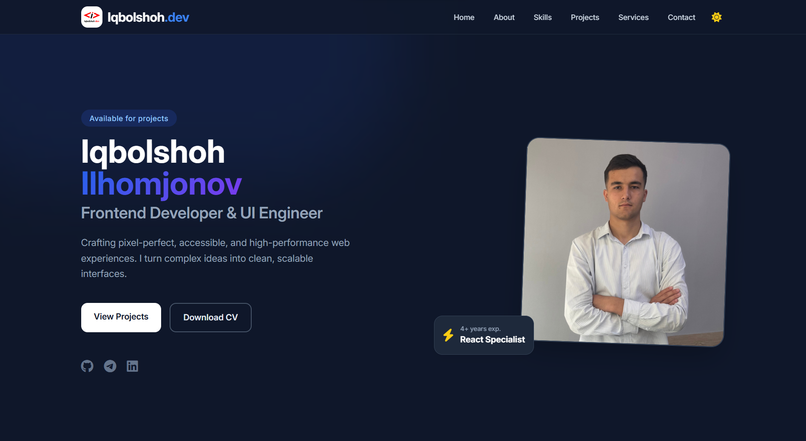
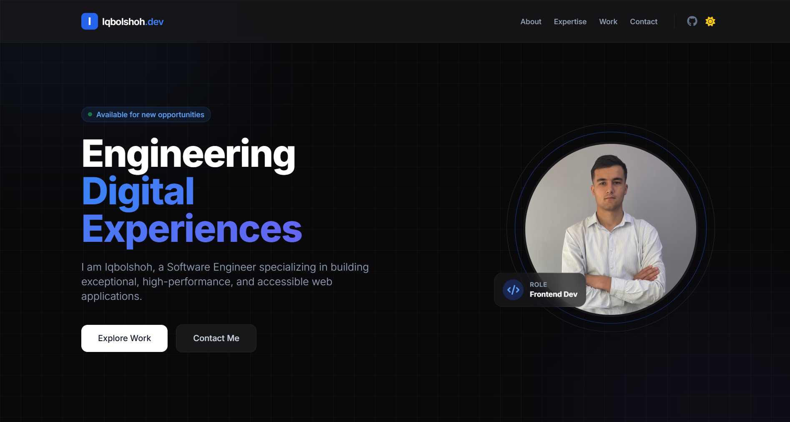

# 🌟 Frontend Developer Portfolio

**Frontend Developer Portfolio** is my personal portfolio project built using modern web technologies to showcase my experience, skills, and completed projects. It features a clean, interactive, and highly attractive interface with multiple design variations.

## ✨ Features

### 1️⃣ Modern UI/UX Design 🎨
✅ **Trendy Layouts:** Utilizes Glassmorphism and Bento grid styles for a modern look.
✅ **Smooth Animations:** Features smooth scrolling, staggered "fade-in-up" load effects, and CSS hover animations.

### 2️⃣ Dark & Light Mode 🌗
✅ **User Preference:** Easily toggle between dark and light themes.
✅ **System Sync:** Automatically adapts to your device's preference.

### 3️⃣ Fully Responsive 📱
✅ **Mobile-First Approach:** Perfectly adapted for mobile devices, tablets, and desktops to ensure the best user experience everywhere.

---

## 🖼️ Previews

This repository contains two distinct variations of the portfolio design. 

### 📌 Version 1: Standard Design (`index.html`)
The standard version features a clean, professional design, soft shadow effects, and a fixed backdrop-blur navigation bar.



### 🚀 Version 2: Premium Design (`v2.html`)
A premium, advanced version featuring ambient glow effects, floating elements, a glassmorphism panel design, and staggered entrance animations.



---

## ⚙️ Installation Guide 🛠️

Follow these steps to run the portfolio locally on your machine:

### 1️⃣ Clone the Repository 📥
```bash
git clone [https://github.com/Iqbolshoh/frontend-portfolio.git](https://github.com/Iqbolshoh/frontend-portfolio.git)
```

### 2️⃣ Navigate to the Project Directory 📂

```bash
cd frontend-portfolio
```

### 3️⃣ Run the Application 🚀

* Simply open the `index.html` or `v2.html` file in your favorite web browser.
* Alternatively, use an extension like **Live Server** in VS Code for a better, live-reloading development experience.

---

## 🖥 Technologies Used


## 📜 License

This project is open-source and available under the **MIT License**.

## 🤝 Contributing

🎯 Contributions are welcome! If you have suggestions or want to enhance the project, feel free to fork the repository and submit a pull request.

## 📬 Connect with Me

💬 I love meeting new people and discussing tech, business, and creative ideas. Let’s connect! You can reach me on these platforms:

<div align="center">
  <table>
    <tr>
      <td>
        <a href="https://iqbolshoh.uz" target="_blank">
          
        </a>
      </td>
      <td>
        <a href="mailto:iilhomjonov777@gmail.com" target="_blank">
          
        </a>
      </td>
      <td>
        <a href="https://github.com/iqbolshoh" target="_blank">
          
        </a>
      </td>
      <td>
        <a href="https://www.linkedin.com/in/iqbolshoh/" target="_blank">
          
        </a>
      </td>
      <td>
        <a href="https://t.me/iqbolshoh_777" target="_blank">
          
        </a>
      </td>
      <td>
        <a href="https://wa.me/998997799333" target="_blank">
          
        </a>
      </td>
      <td>
        <a href="https://instagram.com/iqbolshoh_777" target="_blank">
          
        </a>
      </td>
      <td>
        <a href="https://x.com/iqbolshoh_777" target="_blank">
          
        </a>
      </td>
      <td>
        <a href="https://www.youtube.com/@Iqbolshoh_777" target="_blank">
          
        </a>
      </td>
    </tr>
  </table>
</div>
